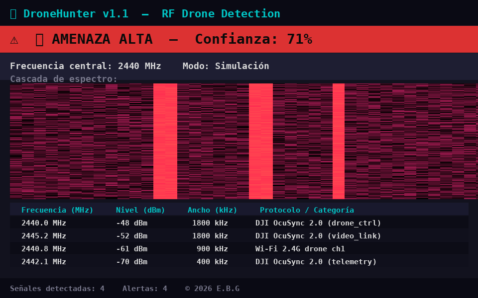
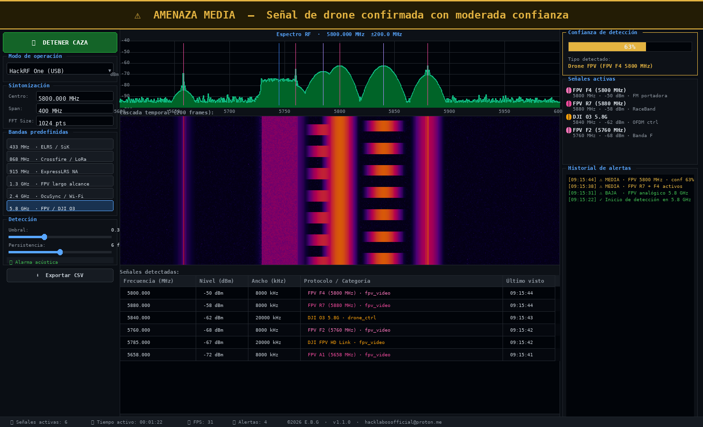
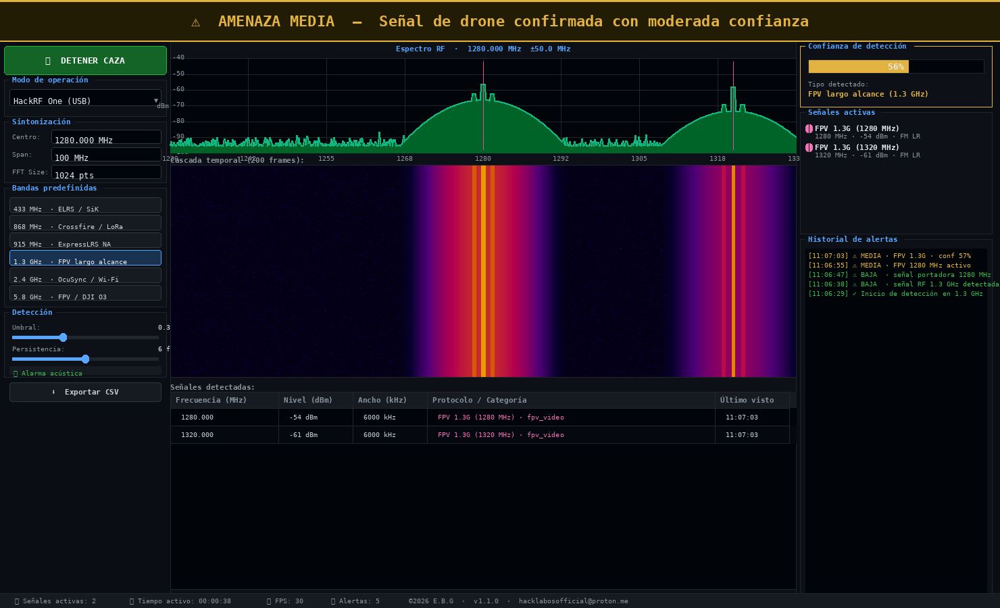
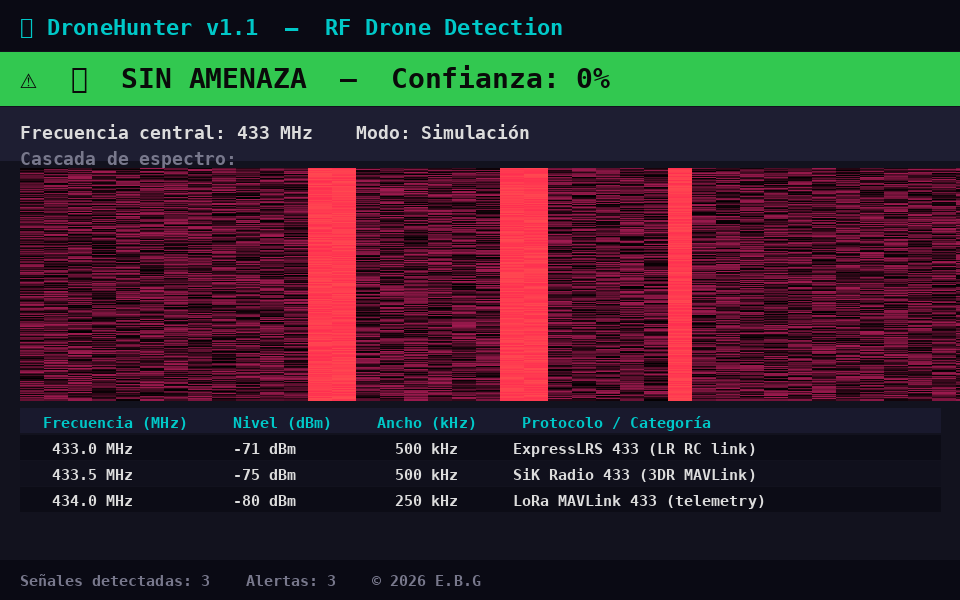
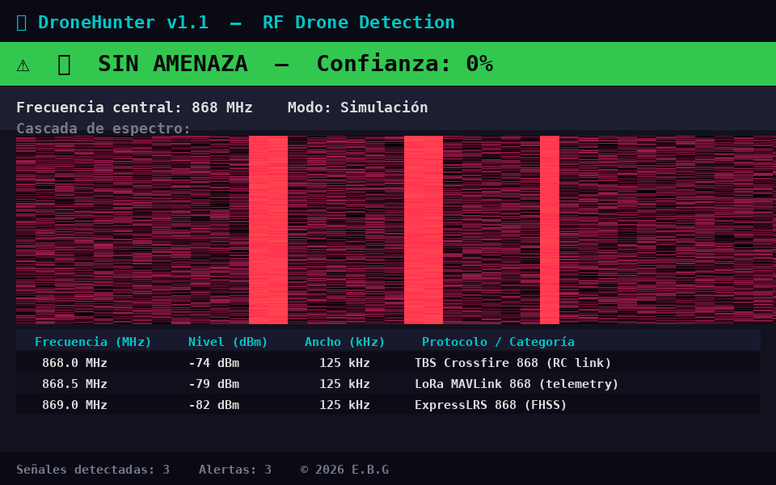
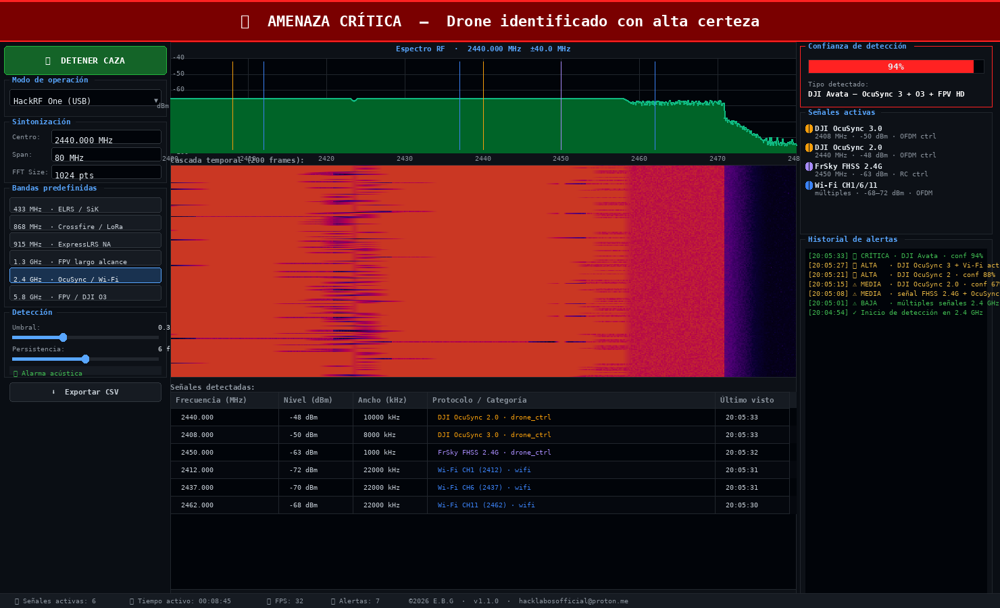

<div align="center">

# DroneHunter 🛸

**Professional RF-based drone detection, classification and real-time threat alerting.**

[](../../releases)
[](../../releases)
[](LICENSE)
[](mailto:hacklabosofficial@proton.me)

</div>

---

## Screenshots

<table>
<tr>
<td align="center">
<br/>
<em>🔴 AMENAZA ALTA — DJI Consumer (OcuSync 2.0) at 2.4 GHz · Confidence 71%</em>
</td>
<td align="center">
<br/>
<em>🟡 AMENAZA MEDIA — FPV 5.8 GHz detected · Confidence 61%</em>
</td>
</tr>
<tr>
<td align="center">
<br/>
<em>🟡 AMENAZA MEDIA — Long-range FPV 1.3 GHz · Confidence 55%</em>
</td>
<td align="center">
<br/>
<em>🟢 SIN AMENAZA — ExpressLRS / SiK telemetry at 433 MHz</em>
</td>
</tr>
<tr>
<td align="center">
<br/>
<em>🟢 SIN AMENAZA — Crossfire / LoRa at 868 MHz</em>
</td>
<td align="center">
<br/>
<em>Full UI — Standalone binary running on Linux</em>
</td>
</tr>
</table>

---

## Features

- **Real-time RF spectrum analyzer** with live waterfall display
- **29 known drone RF signatures** — automatic identification of:
  - DJI OcuSync 2.0 / 3.0 (2.4 GHz) · DJI O3 (5.8 GHz) · DJI FPV HD Link
  - ExpressLRS (433 / 868 / 915 MHz) · TBS Crossfire (868 / 915 MHz)
  - FPV analog video: 5.8 GHz (bands A/B/E/F/R) · 1.2–1.3 GHz long-range
  - FrSky FHSS · Spektrum DSM2/DSMX
  - LoRa MAVLink telemetry · SiK Radio 433 (3DR / RFD900)
  - Wi-Fi 2.4 GHz drone channels
- **4-level threat classification:**

  | Level | Indicator | Description |
  |---|---|---|
  | 🔴 AMENAZA ALTA | ≥ 70% confidence | Known drone actively transmitting |
  | 🟡 AMENAZA MEDIA | 50–69% | Probable drone signal |
  | 🟠 AMENAZA BAJA | 30–49% | Possible drone activity |
  | 🟢 SIN AMENAZA | < 30% | No drone signals detected |

- **Configurable detection engine** — adjustable threshold, persistence, and center frequency
- **Predefined frequency bands** — quick-tune to 433 MHz, 868 MHz, 915 MHz, 1.3 GHz, 2.4 GHz, 5.8 GHz
- **Real-time signals table** — frequency, level, bandwidth, protocol per detection
- **Acoustic alarm** with configurable cooldown
- **Alert history log** with timestamps
- **CSV export** of all detections
- **Simulation mode** — for testing without hardware
- **Professional dark-theme GUI** (PyQt5) — optimized for 24/7 operation
- **3-day trial** included — full license via contact

---

## Download

| Platform | File | Size |
|---|---|---|
| Linux x86_64 | [`drone_hunter`](../../releases/latest) | ~67 MB |

→ **[Latest Release ↗](../../releases/latest)**

No installation required — single standalone executable, no Python needed.

---

## Quick Start

```bash
chmod +x drone_hunter
./drone_hunter
```

1. Click **▶ INICIAR CAZA** to begin scanning
2. Select a **predefined band** or enter a **custom center frequency**
3. Adjust **Umbral** (threshold) and **Persistencia** as needed
4. Enable acoustic alarm if desired
5. Use **Export** to save detections as CSV

---

## Supported Hardware

| Hardware | Mode |
|---|---|
| HackRF One | Full spectrum capture |
| RTL-SDR (RTL2832U) | Receive-only |
| No hardware | Simulation mode ✓ |

---

## Technical Details

```
Architecture   : PyQt5 + pyqtgraph — optimized for 31+ FPS
Detection      : Peak detection → protocol matching → persistence filter → weighted scoring
Classifier     : 29 RF protocol signatures · confidence scoring [0.0–1.0]
Frequency range: 400 MHz – 6 GHz (hardware-dependent)
Export format  : CSV with timestamps, frequency, level, bandwidth, protocol
```

---

## Trial & License

The binary includes a **3-day trial** period.

After the trial expires, a valid **license.key** file is required at:
```
~/.config/drone_hunter/license.key
```

To request a license:

> 📧 **hacklabosofficial@proton.me**
>
> Include your name, intended use, and platform.

---

## Legal Notice

```
PRIVATE LICENSE — © 2026 E.B.G — All Rights Reserved

✔  Personal / educational use with valid license
✘  Commercial, governmental, military use — PROHIBITED
✘  Reverse engineering, decompilation — PROHIBITED
✘  Redistribution or modification — PROHIBITED

The user is solely responsible for compliance with all applicable
RF monitoring and airspace surveillance laws and regulations.
```

See [LICENSE](LICENSE) for full terms.

---

<div align="center">
<sub>© 2026 E.B.G · <a href="mailto:hacklabosofficial@proton.me">hacklabosofficial@proton.me</a></sub>
</div>
